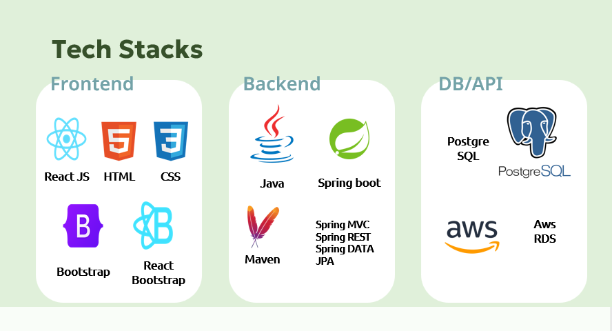
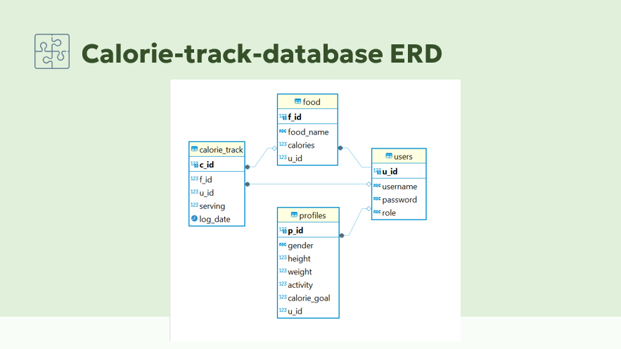

# Calorie Tracker PRO
---

## Developers
- Eugene Kirima
- Hayoung Cheon
- Uriel Cohavy

  ## Installation Guide
You need to run both camp-in-project(Backend) and campin-react-app(Frontend).
* Run SQL in your MySQL workbench.
  
* To run camp-in-project(Backend)
 *  Open IDE for Java
 *  Open Folder of `camp-in-project`
 *  Set environment Variables
    * DB_URL
    * DB_USERNAME
    * DB_PASSWROD
 *  Run `CalorieTrackApp.java`
   
*  To run campin-react-app
 * In your terminal, `cd` to front-end/calorie-tracker
 * `npm install` to install all the dependencies
 * `npm start` or `npm run start` 

### About the Project
  - An app to track your calorie intake to meet your specific calorie count goal. It helps users track their calorie intake to meet their calorie count goals and maintain their health.

### Key Features
  - User authentication and profile management.
  - BMI calculation.
  - Calorie calculation.
  - Daily and weekly calorie count monitoring
  - Admin Functionality for food database management.

### User Stories
  - Users can register and create user accounts.
  - User can log in and log out from their account.
  - User can create a profile with the following information
    - gender, height, weight, activity levels, and calorie goals.
  - User can view their profile information.
  - User can edit and delete their profile
  - User can view their BMI calculation (calculated from their profile details)
  - Users can search for foods in the database and enter the food they have eaten to track the calories taken per meal per day.
  - User can view or monitor their daily calorie intake and goal in the calorie track view dashboard.
  - Users can monitor their intake progress weekly
  - The admin can add, update, and delete foods from the food data.
  - Admin can access and manage users.

### Tech Stacks

* Front End
  * React JS
  * HTML
  * CSS
  * React BootStrap
  * JavaScript
* Backend
  * Java
  * Spring Web Framework
  * Spring boot project
  * Spring Modules: Spring MVC, Spring REST, Spring Data JPA
  * Maven
* DB
  * PostgreSQL
  * AWS RDS

### Database Schema

### Presentation Documents
* We recommend reading the pdf file.

### Demonstration
* Landing Page
   
* Login
   
* User Profile registration
   
* User Profile update
   
* User BMI Calculation
   
* User Calorie track view
   
* User Calorie track registration
   
* User Calorie track update
   
* User Calorie track deletion
   
* User Logout
   
* Admin food add/view
   
* Admin food update/delete
   
* Admin user management.
   

